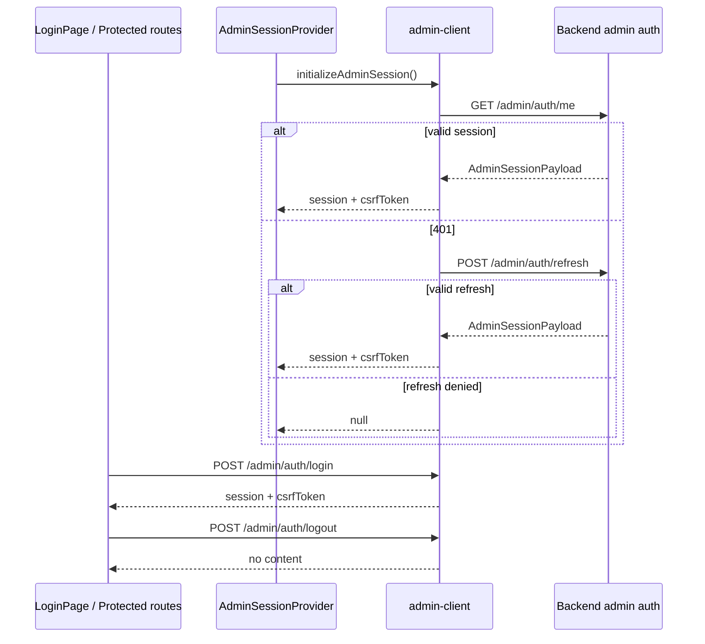

# Authentication and session

## Overview

The admin frontend consumes a dedicated backend session for the admin namespace. Session cookies are managed by the backend; the frontend only sends requests with `credentials: include`.

Used endpoints:

- `/admin/auth/login`
- `/admin/auth/me`
- `/admin/auth/refresh`
- `/admin/auth/logout`

## Diagram: session lifecycle

## Login

`LoginPage`:

- collects `email` and `password`,
- trims the email before submit,
- calls `login(email, password)` through `useAdminSession`,
- redirects to `location.state.from` or `/dashboard`.

If a session already exists, the page redirects immediately.

## Bootstrap on protected routes

`App.tsx` applies:

- `RequireAuth` on every internal route,
- `RequireSuperAdmin` on `/organizations`.

Behavior:

- initial loading: "Chargement du contexte administrateur" screen,
- missing session: redirect to `/login`,
- valid session but insufficient scope: redirect to `/forbidden`.

## Logout

Logout:

- calls `/admin/auth/logout`,
- clears the in-memory CSRF token,
- resets the frontend session to `null`.

## Security invariants

- The CSRF token is stored in memory only through `src/lib/admin-security.ts`.
- `X-Admin-CSRF` is added only on mutating requests.
- No auth secret is stored in `localStorage`, `sessionStorage`, or IndexedDB.
- UI guards are not final authorization; the backend remains the source of truth.

## Links

- Architecture: [`architecture.md`](architecture.md)
- Security: [`security-privacy.md`](security-privacy.md)
- Troubleshooting: [`troubleshooting.md`](troubleshooting.md)
