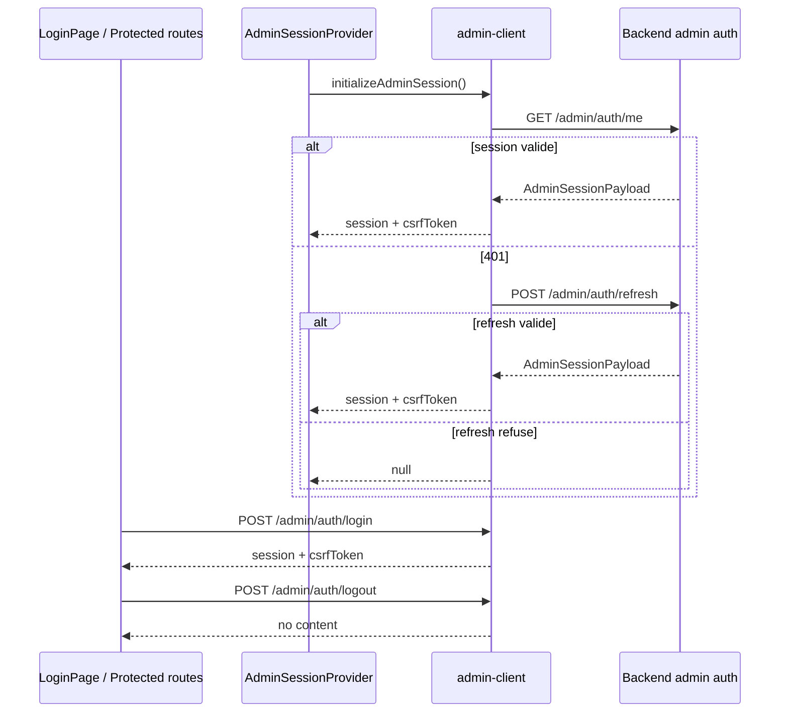

# Authentification et session

## Vue d ensemble

Le front admin consomme une session backend dediee au namespace admin. Les cookies de session sont geres par le backend; le front envoie simplement les requetes avec `credentials: include`.

Endpoints utilises:

- `/admin/auth/login`
- `/admin/auth/me`
- `/admin/auth/refresh`
- `/admin/auth/logout`

## Diagramme: cycle de session

## Login

`LoginPage`:

- collecte `email` et `password`,
- trim l email avant soumission,
- appelle `login(email, password)` via `useAdminSession`,
- redirige vers `location.state.from` ou `/dashboard`.

Si une session existe deja, la page redirige immediatement.

## Bootstrap sur routes protegees

`App.tsx` applique:

- `RequireAuth` sur toutes les routes internes,
- `RequireSuperAdmin` sur `/organizations`.

Comportements:

- chargement initial: ecran "Chargement du contexte administrateur",
- session absente: redirect vers `/login`,
- session valide mais scope insuffisant: redirect vers `/forbidden`.

## Logout

Le logout:

- appelle `/admin/auth/logout`,
- vide le token CSRF memoire,
- remet la session front a `null`.

## Invariants de securite

- Le token CSRF est stocke uniquement en memoire via `src/lib/admin-security.ts`.
- `X-Admin-CSRF` est ajoute uniquement sur les requetes mutantes.
- Aucun secret auth n est stocke dans `localStorage`, `sessionStorage` ou IndexedDB.
- Les gardes UI n ont pas valeur d autorisation definitive; le backend reste la source de verite.

## Liens

- Architecture: [`architecture.md`](architecture.md)
- Securite: [`security-privacy.md`](security-privacy.md)
- Depannage: [`troubleshooting.md`](troubleshooting.md)
